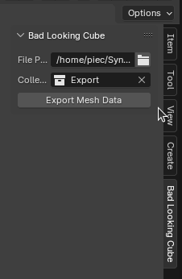

# Bad Looking Cube B3D Collection Exporter

## Overview

The Bad Looking Cube B3D Collection Exporter is a Blender add-on for exporting mesh data to a CSV file format. It's designed to be a simple yet effective tool for users needing to transport Blender mesh data into a universally accessible format. This add-on is especially useful for artists, developers, and anyone interested in processing or analyzing mesh data outside of Blender.

## Features
- Export mesh data including vertex positions, face indices, and other relevant geometric data.
- Easy to use interface integrated into the View3D > Sidebar.
- Quick export functionality with a simple click.
- Compatibility with Blender 2.80 and above.

## Installation

1. Download the latest release from the GitHub repository.
2. Open Blender and go to `Edit > Preferences > Add-ons`.
3. Click `Install` and navigate to the downloaded `.py` file.
4. Enable the add-on by ticking the checkbox next to its name.

## Usage

After installation, the add-on can be accessed in the Blender UI under the View3D > Sidebar > Mesh Exporter Tab. To export data:

1. Select the mesh/meshes you want to export.
2. Go to the Bad Looking Tab tab.
3. Configure any export settings if available.
4. Click the "Export" button and choose the destination for your CSV file.

## Contributing

Contributions to the Bad Looking Cube B3D Collection Exporter are welcome! If you have suggestions, bug reports, or contributions, please open an issue or a pull request with your changes.

## License

This project is licensed under MIT - see the LICENSE file for details.

## Acknowledgments

- Krzysztof Krystian Jankowski, for the initial development of this add-on.
- [Any other contributors or helpful resources you want to acknowledge]

