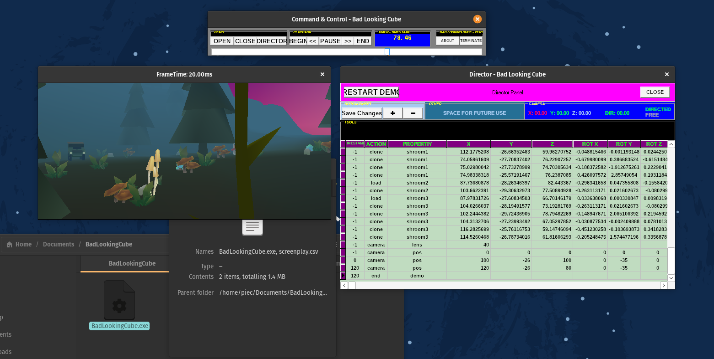

# BAD LOOKING CUBE
Demo(tool) for Windows made using Delphi 7, Pascal, and OpenGL technologies.

## Download
### Demotool
- Release/BadLookingCube.exe
- Release/screenplay.csv
### Standalone Demo
- TBA

## Run
I succesfully run the binary on those systems:
- Windows 2000
- Windows 11
- SteamDeck (Proton)
- Linux Steam (Proton)

## Development
Project is made using:

On the actual retromachine:
- Windows 2000
- Delphi 7 (Pascal)
- OpenGL (1.x)

On modern machine:
- ChatGPT - [GPT: Retro Code Companion // Delphi Edition](https://chat.openai.com/g/g-UmgMxLwjM-retro-code-companion-delphi-edition)
- Blender 3
